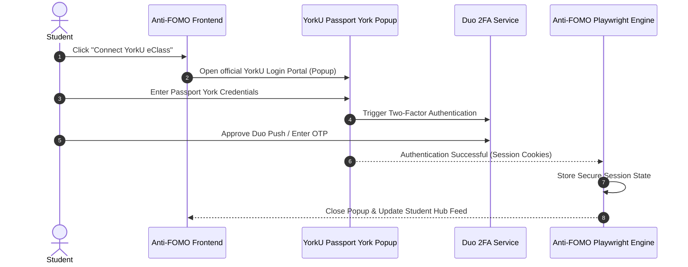

# Anti-FOMO: Frontend & UI/UX Enhancement Plan

This document outlines the strategic roadmap for transforming the **Anti-FOMO** frontend into a premium, highly organized, and feature-rich student hub. The goal is to elevate the aesthetics, streamline navigation, accommodate secure 2FA authentication, and vastly improve how scraped data is presented and explored.

---

## 1. Aesthetic Vision & Design System

The frontend will be redesigned from the ground up to feel state-of-the-art, dynamic, and visually stunning at first glance.

* **Modern Typography & Palette:** Clean, modern font pairings (e.g., *Inter* or *Outfit*) combined with a curated, high-contrast dark mode and sleek glassmorphic header bars (`backdrop-blur-md`).
* **Dynamic Interactions & Micro-animations:** Responsive hover states, smooth transitions, and subtle animations that make the UI feel alive and polished.
* **Structured Layout:** Clear visual hierarchy separating general tech news, academic updates, and career opportunities, moving away from generic lists.

---

## 2. YorkU Passport York Authentication (with Duo 2FA)

### Current Limitation
The current implementation asks students to input their raw Passport York username and password into a standard form on our webpage. This approach feels untrusted and creates friction when students need to complete **Duo 2FA** (push notifications, OTP, or security keys).

### The Enhancement: Official Login Popup Window
* **Actual YorkU Login Page:** Instead of an embedded form, clicking **"Connect YorkU eClass"** will trigger a secure popup window or modal webview displaying the **authentic YorkU Passport York login portal**.
* **Seamless Duo 2FA Support:** Because the student interacts directly with York University's official authentication server inside the popup, all 2FA methods (Duo Mobile push, SMS, security keys) will execute natively and reliably.
* **Session Capture & Security:** Once authenticated, the underlying Playwright engine securely captures the session cookies/state and closes the popup. Student credentials are never entered into or touched by Anti-FOMO's custom input fields.

---

## 3. Better Prioritization & Information Architecture

Rather than combining all scraped items into one generic feed, the application will be divided into structured, purpose-built sections:

### 🏠 Home Page: Top Prioritized Results
* **AI & Relevance Prioritization:** The home feed will highlight the top-ranking opportunities specifically tailored to the student’s major, coursework, and interests.
* **Curated Widgets:**
  * **🔥 Top Match Today:** The highest-scored internship or job matching the user's profile.
  * **⏰ Urgent Course Deadlines:** Immediate eClass deadlines due within the next 72 hours.
  * **📰 Trending in Tech:** Top stories from Hacker News, Phoronix, and TLDR Tech.

### 💼 Dedicated Internship Section
A comprehensive discovery engine specifically built for browsing internships, co-ops, and new graduate roles scraped from *SimplifyJobs*, *Pitt CSC*, and company career pages.

* **Advanced Multi-Option Filtering:**
  * **Discipline / Major:** Software Engineering, Data Science, Hardware, AI/ML, DevOps, etc.
  * **Role Specialty:** Frontend, Backend, Full-Stack, DevOps, AI/ML, Embedded, Product Management.
  * **Location & Modality:** Remote, Hybrid, On-site (with city/country filters like *Toronto*, *Vancouver*, *US-Only*).
  * **Source Platform:** Filter specifically by source (e.g., show only *Simplify* or *Pitt CSC* listings).
  * **Freshness / Date Posted:** *Last 24 Hours*, *Past Week*, *Past Month*.
* **Search & Sort:** Instant keyword search with sorting by *Relevance Score*, *Newest First*, or *Company Name*.

---

## 4. Redesigned Opportunity Cards

### The Problem with Current Cards
Current cards offer minimal metadata, lack visual hierarchy, and force users to guess whether an item is worth exploring based on a single title and brief text snippet.

### Enhanced Card Faces
The new cards will act as rich summaries designed for quick scanning:
* **Visual Identity:** Prominent company logos or platform avatars alongside clean badges indicating item type (*Internship*, *Event*, *Article*).
* **At-a-Glance Metadata:**
  * **Company & Role:** High-contrast typography distinguishing the company from the job title.
  * **Key Attributes:** Clear tags for *Location*, *Term (Summer 2026)*, and *Discipline*.
  * **Match Badge:** A prominent **"⭐️ Top Match"** or **"98% Relevance"** indicator calculated by our backend classification engine.
* **Actionable Footer:** Shows exactly when the item was scraped and provides an immediate visual cue that the card is interactive.

---

## 5. Interactive Details Modal & Direct Action

To keep the browsing flow uninterrupted, clicking any card will no longer abruptly navigate away or open unverified tabs without context.

### 🔍 Detailed Information Modal / Drawer
When a student clicks on a card, a sleek modal dialog or slide-over drawer will animate into view containing:
* **Full Scraped Context:** Complete job descriptions, qualification requirements, compensation details (if scraped), event schedules, or article summaries.
* **Source Transparency:** Clearly displays where the data originated (e.g., *"Aggregated from GitHub Summer 2026 Internships repo"*).
* **Tag Cloud:** All relevant keywords and academic disciplines associated with the item.

### 🚀 Direct Action CTA
At the bottom (and top right) of the modal, a high-contrast, prominent button will allow the user to take immediate action:
* **"Apply on Simplify ↗"** or **"Visit Company Career Page ↗"** for internships and jobs.
* **"Read Full Article on Hacker News ↗"** for tech news.
* **"Register on Luma ↗"** for local tech events.

---

## 6. Summary Implementation Roadmap

| Phase | Focus Area | Key Deliverables |
| :--- | :--- | :--- |
| **Phase 1** | **UI/UX Core & Aesthetics** | Overhaul `index.css`/Tailwind themes, implement dark mode glassmorphism, create responsive layout shells. |
| **Phase 2** | **YorkU Login Popup & 2FA** | Build popup/webview window for Passport York login, integrate Playwright session capture for Duo 2FA. |
| **Phase 3** | **Internship Hub & Filters** | Build dedicated `/internships` page with multi-select dropdowns, keyword search, and relevance sorting. |
| **Phase 4** | **Cards & Details Modal** | Redesign card components with logos and badges; build interactive modal drawer with direct external CTA buttons. |
