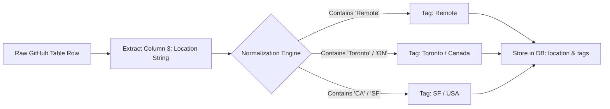
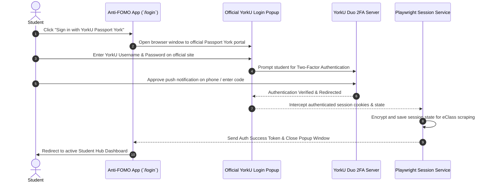

# Anti-FOMO: Internship Location Scraping, Feed Filters & YorkU 2FA Authentication Plan

This document details the architecture and implementation roadmap for three critical enhancements: extracting and normalizing internship locations, adding robust multi-parameter filters to both the Internships Hub and the main Home Feed, and replacing the basic login form with an official YorkU Passport York popup window to support Duo 2FA.

---

## 1. Scraping & Normalizing Internship Locations

### Current Limitation
While our GitHub internship scrapers (*SimplifyJobs* and *Pitt CSC*) pull row data from markdown tables, location information is currently either trapped inside unstructured `content_text` strings (e.g., `"Location: Toronto, ON | Remote"`) or ignored entirely.

### Enhancement Specification
1. **Schema & Model Upgrade:**
   - Add a dedicated `location: Optional[str]` field to the `ScrapedItem` TypedDict, SQLAlchemy `DBScrapedItem` model, and API response schemas.
2. **Scraper Extraction Logic:**
   - **Simplify Scraper:** Column 3 (`tds[2]`) in the Simplify table explicitly lists the job location. Extract this raw string and assign it to the new `location` property.
   - **Pitt CSC Scraper:** Column 3 (`tds[2]`) in the Pitt CSC table also contains location data. Extract and clean this text.
   - **Company Career Pages:** For direct postings, parse standard location patterns (city, state/province, country, or remote indicators).
3. **Location Normalization Engine:**
   - Categorize raw location strings into structured tags to power UI filters:
     - **Modality Tags:** `Remote`, `Hybrid`, `On-site`
     - **Region Tags:** `Canada`, `USA`, `Global / Multi-region`
     - **Key Tech Hub Cities:** `Toronto`, `Vancouver`, `Waterloo`, `San Francisco`, `New York`, `Seattle`, `London`

---

## 2. Dedicated Internship Location Filtering

With location data structured and stored in the database, the **Internships Section** (`/internships`) will be upgraded with interactive location filtering.

### UI/UX Filter Components
* **Modality Quick-Toggles:** Buttons at the top of the search bar to instantly toggle between **All**, **Remote Only**, **Hybrid**, and **On-site**.
* **Region / City Dropdown:** A multi-select filter allowing students to check specific regions or cities (e.g., selecting both *Toronto* and *Waterloo*, or filtering strictly for *Canada-Only* internships).
* **Smart Fallback:** If an internship lists `"Multiple Locations"`, expanding the item card modal will display the complete breakdown of all eligible office locations.

---

## 3. Useful Filters for the Main Home Feed (`/`)

The main feed currently only allows searching by keyword and toggling between `All` and `Software Engineering`. To make the feed significantly more useful for daily browsing, we will introduce a multi-faceted filter bar:

| Filter Category | Available Options | Purpose |
| :--- | :--- | :--- |
| **📦 Item Type** | `All`, `Internships`, `Events`, `Articles` | Lets users isolate career postings from tech news or community hackathons. |
| **🌐 Source Platform** | `All Sources`, `Simplify`, `Pitt CSC`, `Hacker News`, `Phoronix`, `TLDR Tech`, `Luma` | Allows filtering for specific aggregators or news outlets. |
| **⏱️ Date Posted** | `Any Time`, `Last 24 Hours`, `Past Week`, `Past Month` | Prevents stale listings and lets users check what dropped today. |
| **📊 Sort Order** | `Relevance Score (Top Match)`, `Newest First` | Prioritizes AI-matched opportunities or chronological order. |

---

## 4. Replacing Basic Sign-In with Official YorkU 2FA Popup

### Why the Basic Login Form Must Be Removed
Our current setup presents inline text input fields asking students for their Passport York username and password. This causes two critical problems:
1. **Duo 2FA Failure:** York University enforces Duo Two-Factor Authentication (push notifications, SMS codes, or hardware security keys). Inline form scraping cannot cleanly or securely interact with interactive 2FA challenges without creating friction or failing silently.
2. **Security & Trust:** Students should never type their university credentials into third-party web forms.

### The New Architecture: Official YorkU Login Popup Window
We will remove the inline login form entirely and replace it with a single **"Sign in with YorkU Passport York"** button.

### Key Security & Verification Benefits:
* **Native 2FA Support:** Because the login happens inside a genuine browser window loading `https://passportyork.yorku.ca`, any Duo 2FA prompt (push, passcode, Duo Mobile app verification) renders natively exactly as it does when logging into eClass normally.
* **Zero Credential Handling:** Anti-FOMO never sees, handles, or transmits the student's password. We only capture the resulting session cookie after York University verifies the student's 2FA challenge.

---

## 5. Summary Roadmap

1. **Database & Scraper Update:** Add `location` column to `scraped_items` table; update Simplify and Pitt CSC scrapers to parse column 3 and normalize city/remote tags.
2. **Internships UI Update:** Add location modality toggles (*Remote*, *Hybrid*, *On-site*) and city multi-select filters to `/internships`.
3. **Home Feed Filters:** Add dropdowns on `/` for *Item Type*, *Source Platform*, and *Date Posted*.
4. **YorkU 2FA Popup Authentication:** Delete inline username/password inputs from `/login`; implement popup window handler and Playwright session cookie interceptor.
